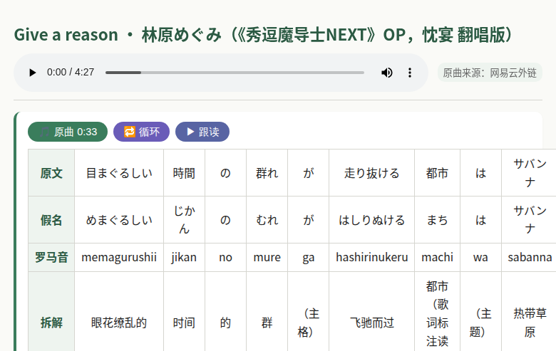
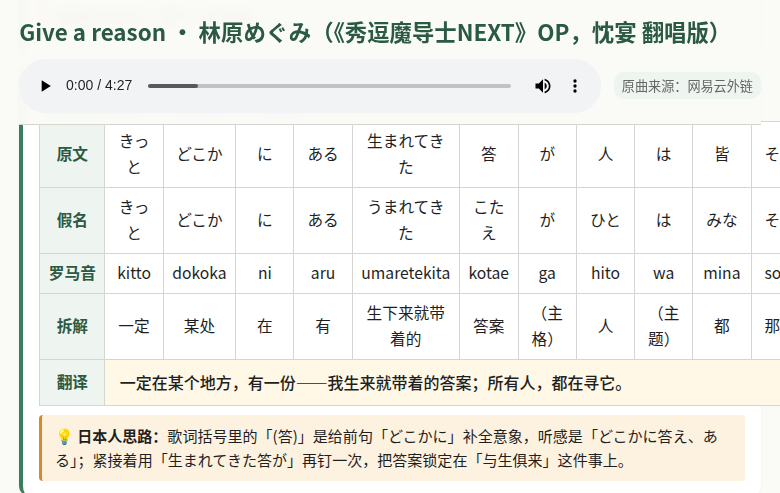
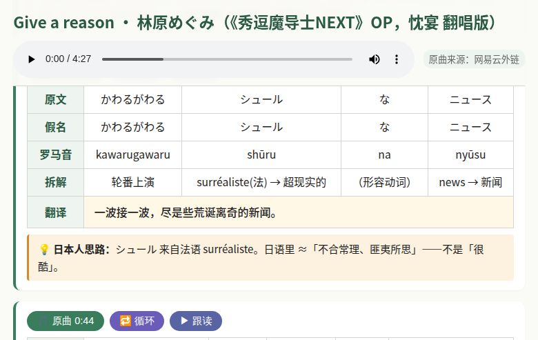
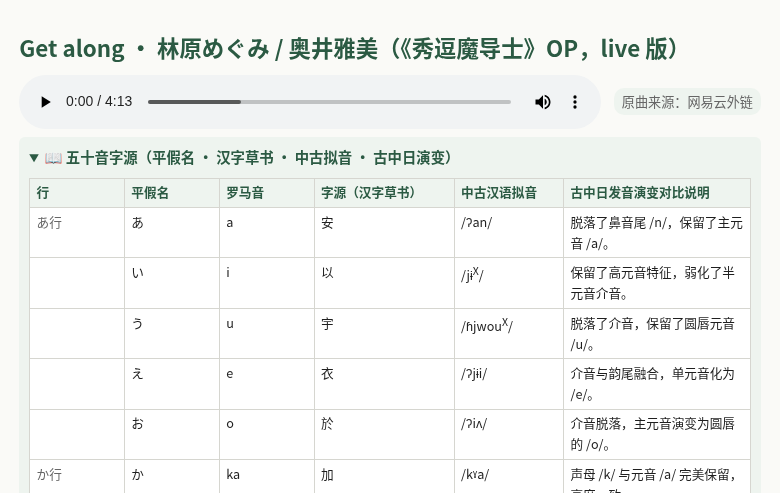

# lovjpn · 日语深拆学习页生成器

一个 Claude Code / Claude Agent SDK 的 **Skill**。喂给它日文（一句话、一段对话、或者一首歌名），它就为中文母语学习者生成一张可读可听的学习网页：每句做 5 行对齐表（原文 / 假名 / 罗马音 / 拆解 / 翻译），每句都有 **▶ 跟读**（edge-tts 慢速朗读）按钮；如果输入是歌，页面顶部还会挂上原曲播放器，当前句自动高亮，并为每句提供 **🎵 原曲** 跳转 + **🔁 循环** 单句复读。

> "让每一句日语都被拆到骨头里，然后再用耳朵把它装回去。"

---

## 效果图

顶部原曲播放器 + 滚动高亮：



逐句 5 行对齐表（原文 / 假名 / 罗马音 / 拆解 / 翻译）：



片假名外来语显示源词（`news → 新闻` / `savanna → 热带草原`）：



内置可折叠的 **五十音字源** 面板：



---

## 这个 skill 在做什么

1. **Mode A（歌名模式）**：`scripts/fetch_song.py "<歌手> <歌名>" <output_dir>`
   - 从 tonzhon.com 抓 NetEase 的 LRC 歌词 + 时间戳
   - 原曲音频优先用 NetEase 外链；失败时 yt-dlp 回落到 SoundCloud / YouTube
   - 生成 `skeleton.json`（带 `timestamp_ms` 的逐行骨架）+ `lyrics.lrc` + `original.mp3`
2. **Agent 拆解**：读骨架，按语法把 LRC 逐行合并成完整句子（LRC 是按乐句断的，不是按语义——所以 76 行常对应 ~40 句真正的句子），再为每句填 `words`（逐词拆解）+ `translation` + 可选 `note`
3. **Mode B（原文模式）**：跳过 1，直接把 `input.json` 写出来
4. **构建页面**：`scripts/build_study.py input.json <dir>` 生成 `index.html` + 每句的 edge-tts MP3

完整的语言学规则、合并策略、JSON schema、输出质量要求都写在 [`SKILL.md`](SKILL.md) 里——它既是给 Claude 看的指令，也是这个项目的核心设计文档。

---

## 安装 & 使用

### 一键安装（推荐，走 [skills.sh](https://skills.sh) 生态）

```bash
# 装到当前项目（./claude-code/skills/japanese-deep-translate/）
npx skills add jingx8885/lovjpn

# 或装到全局（~/.claude/skills/japanese-deep-translate/）
npx skills add jingx8885/lovjpn -g
```

支持 Claude Code / Cursor / Codex / OpenCode 等 40+ agent，会自动放到对应目录。装完在 skill 目录下建虚拟环境：

```bash
cd <装好的目录>
python3 -m venv .venv
.venv/bin/pip install edge-tts yt-dlp
```

### 手动 clone（不想走 CLI 的话）

```bash
git clone https://github.com/jingx8885/lovjpn.git ~/.claude/skills/japanese-deep-translate
cd ~/.claude/skills/japanese-deep-translate
python3 -m venv .venv
.venv/bin/pip install edge-tts yt-dlp
```

### 装好之后

在 Claude Code 里直接说：

- "拆解 YOASOBI 的 群青"
- "帮我学 林原めぐみ 的 Give a reason"
- "翻译一下这段日语：〈粘贴任意日文〉"

Claude 会自动调用这个 skill，把成品页面写到 `song/<slug>/` 下。

### 手动跑（脱离 Claude）

```bash
# Mode A：搜歌 → 骨架
.venv/bin/python3 scripts/fetch_song.py "YOASOBI 群青" ./song/qunqing

# 手动/用其他 LLM 把 skeleton.json 里每句补全成 input.json（见 SKILL.md 的 JSON schema）

# 构建页面
.venv/bin/python3 scripts/build_study.py ./song/qunqing/input.json ./song/qunqing
```

打开 `song/qunqing/index.html` 即可。

---

## 页面功能

- **顶部原曲播放器**（仅歌曲模式）。播放时当前句自动高亮；用户停止滚动时页面会把当前句滚到视口中央。
- **🎵 原曲 M:SS**：跳到该句的原曲时间戳并播放，取消循环。
- **🔁 循环**：把原曲锁在该句的时间段内复读。再点一次同一按钮取消；点另一句的 🔁 切换目标。**口型跟读最核心的那个按钮**。
- **▶ 跟读**：播放该句的 edge-tts（慢速、字正腔圆，专用于 shadowing）。跟读时原曲暂停，但不取消循环——之后继续 play 会接着循环。
- **📖 五十音字源**（页顶折叠面板）：一张 CSV 表，把每个假名钩回它取自的汉字草书 + 中古汉语拟音 + 古中日演变。中文母语者可以顺着字形记音，数据源是 [`references/pronoun.md`](references/pronoun.md)。

---

## 目录结构

```
.
├── SKILL.md                   # skill 主入口（给 Claude 读的指令）
├── scripts/
│   ├── fetch_song.py          # tonzhon → LRC + MP3；yt-dlp 回落
│   └── build_study.py         # input.json → index.html + 每句 TTS
├── references/
│   └── pronoun.md             # 五十音字源 CSV（可扩展）
└── docs/                      # README 用的截图
```

---

## 依赖

- Python ≥ 3.10
- [`edge-tts`](https://pypi.org/project/edge-tts/) — 朗读用，走微软 Edge 的 TTS 服务（免费、无需 key）
- [`yt-dlp`](https://pypi.org/project/yt-dlp/) — 原曲下载的回落方案
- 不需要 ffmpeg；不需要任何 API key

---

## 已知限制

- **版权**：`fetch_song.py` 只是把用户指明的歌抓下来做个人学习用。请勿把生成的 `song/` 目录公开发布。
- **语音合成**：edge-tts 依赖微软服务，偶尔抽风时 build_study 会跳过失败的句子；重跑即可补齐。
- **时间戳**：LRC 只到秒级（偶尔 0.1s），逐句高亮在快节奏歌曲里可能差半拍。单句循环用 LRC 时间戳 → 下一句的 `timestamp_ms` 做窗口。
- **副歌**：LRC 会把副歌的每次出现都列出来。skill 的合并规则会把它们合成完整句，但如果原 LRC 在第二次副歌漏了几行，需要手动补。

---

## License

[PolyForm Noncommercial 1.0.0](LICENSE) — 允许任何**非商业用途**（个人学习、学术、非营利教学）的使用、复制、修改、分发。**商用须单独授权**。选这个许可证是因为：skill 本身是为学日语的朋友写的，我不希望有人打包成付费产品卖，而 Apache / MIT 等 OSI 协议默认允许商用。

如需商用授权，请开 issue 或联系仓库所有者。

---

## 致谢

- 五十音字源表的中古汉语拟音数据部分参考了 Baxter–Sagart 的构拟系统。
- 原曲搜索链路依赖 [tonzhon.com](https://tonzhon.com) 对 NetEase 的代理查询接口。
- edge-tts 的日语声库 `ja-JP-NanamiNeural` / `ja-JP-KeitaNeural` 让 shadowing 成为可能。
